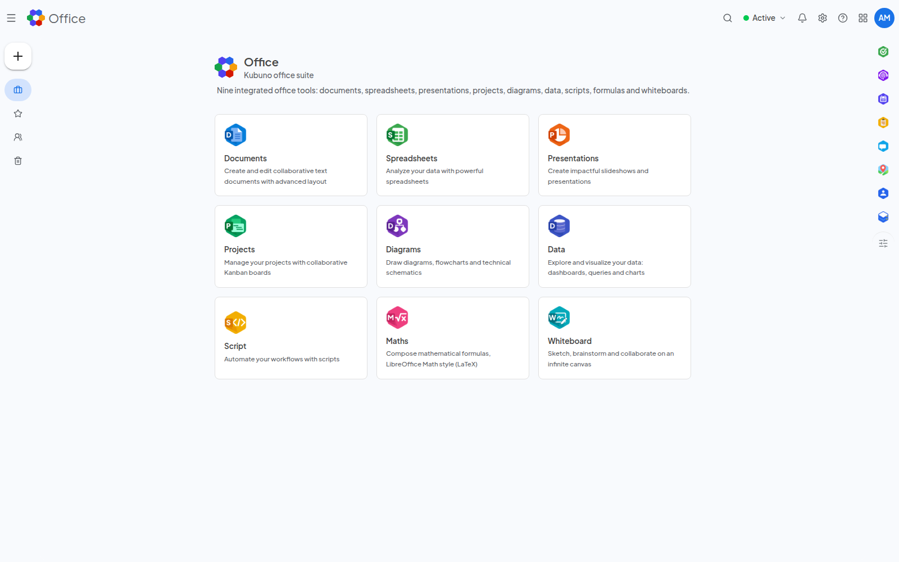

<!--
  SPDX-FileCopyrightText: 2026 Kubuno contributors
  SPDX-License-Identifier: AGPL-3.0-or-later
-->

<div align="center">


# Kubuno — Office

[](LICENSE)


**The collaborative office suite for [Kubuno](https://github.com/kubuno/core) — the self-hosted, libre (AGPLv3) cloud platform, a sovereign alternative to Google Workspace and Microsoft 365.**

Nine real-time collaborative editors — documents, spreadsheets, presentations,
project management and more — all storing their content as Kubuno files.

</div>

---

## Screenshots



<sub>The Office suite — nine integrated tools</sub>

## Apps

Office is a suite of collaborative editors, each reachable under `/office/<app>`:

|   | App | Path | What it does |
|---|---|---|---|
|  | **Documents** | `/office/documents` | Word processor (sections, styles gallery, comments, footnotes, table of contents, advanced tables, text effects, format painter, PDF export) |
|  | **Spreadsheets** | `/office/spreadsheets` | Spreadsheet with a 300+ function formula engine, pivot tables, protection & whole-workbook encryption |
|  | **Presentations** | `/office/presentations` | Slide decks |
|  | **Projects** | `/office/projects` | Project management, Gantt & critical path, and a full PMI toolkit |
|  | **Diagrams** | `/office/diagrams` | Diagramming (shapes, connectors) |
|  | **Data** | `/office/data` | BI / reporting — datasets and native charts (SQL-backed datasets are disabled for now; see the changelog) |
|  | **Script** | `/office/script` | Code / scripting editor |
|  | **Maths** | `/office/maths` | Formula editor (KaTeX) with a built-in symbolic engine |
|  | **Whiteboard** | `/office/whiteboard` | Collaborative whiteboard |

All editors share real-time collaboration (Yjs) and store their content as Kubuno files.

## Features

- **Documents** — a paginated, canvas-rendered word processor: margin-anchored comments, footnotes, a regenerable table of contents, heading numbering, advanced font controls (small caps, letter spacing), drop caps, per-section margins, and full-featured tables (repeated header rows, sorting, column distribution, split, custom borders, `SUM` formulas). It adds a text-effects & typography gallery (outline, shadow, reflection, glow, OpenType options — round-tripped through `.docx`) and a Format Painter. Selections drag & resize, rulers follow the page under the caret, spell checking ships with a per-language dictionary, and find & replace plugs into the platform's search bar.
- **Spreadsheets** — a formula engine with **300+ functions** (math, statistics, text, date, logical, financial, engineering, lookup), dynamic arrays (`FILTER`, `SORT`, `UNIQUE`, `XLOOKUP`…) and modern `GROUPBY` / `PIVOTBY` aggregations, plus persistent pivot tables, cell comments, Goal Seek, a print dialog, sheet password protection and **whole-workbook encryption** — cells are stored encrypted at rest and never travel in clear.
- **Projects** — a professional planner: Gantt with working-day scheduling and a draggable critical path, a resizable task table, a live pannable **Network** (precedence) diagram with a time-scaled mode, all four dependency types with lead/lag, baselines, and a full **PMI toolkit** — charter, WBS & dictionary, requirements traceability, deliverables, risk & issue registers, change control, earned value, resource management with a workload heatmap, cost/budget & contract registers, stakeholders & RACI, quality metrics, a portfolio view, and one-click generation of PMI documents straight into Drive as editable Kubuno files.
- **Maths** — a WYSIWYG + LaTeX formula editor backed by a symbolic engine (derivatives, simplification, root finding, tangents, extrema, Taylor expansions, function tables and plots, matrix operations, statistics & regression, number theory), with rich LaTeX autocompletion; formulas copy as Kubuno data envelopes and paste as live cards into other modules.
- **A shared ribbon** — a File backstage, contextual tabs, a clipboard group in every editor, and responsive behaviour that collapses ribbon groups into dropdown buttons as the window narrows.
- **Versions & safe saving** — restore any earlier version of a file; a document open in a live editing session, or restored meanwhile, can no longer be silently overwritten by a stale save, and a retried write is recognised instead of applied twice. A file that cannot be opened says why.
- **Local-first sync** — every editor exposes a cursor-based `/delta` endpoint (change sequences + tombstones) so desktop and offline clients can pull incremental changes and replay local creations with client-minted ids.
- **i18n** — dates throughout are written by the platform in each viewer's own language.

## Architecture

Office is a **Kubuno module**: a standalone Rust process (port `3105`) that registers with the [core](https://github.com/kubuno/core) at startup. The core proxies its routes (`/api/v1/office/*`) and serves its runtime-loaded frontend bundle.

```
core (kubuno/core)  ──proxy──►  kubuno-office (this repo, :3105)
       │                              ├─ Rust backend (Axum + PostgreSQL, schema `office`)
       └─ serves /modules/office/entry.js (React frontend, loaded at runtime)
```

- **Backend** — `src/`: Axum + SQLx (PostgreSQL, schema `office`); migrations in `migrations/`.
- **Frontend** — `frontend/`: a React bundle built to `entry.js`, consuming `@kubuno/sdk`, `@kubuno/ui` and `@kubuno/drive` from npm (provided by the host at runtime via the import map).

## Install

Modules install as a **Kubuno package (`.kbpkg`)** — a single, self-contained archive the Kubuno server unpacks itself (in pure Rust, identically on Linux, Windows and macOS). There are no native system packages for a module; only the core ships those.

The easiest way to self-host a full Kubuno instance (core + every module) is the **all-in-one [Docker image](https://github.com/kubuno/docker)** (`ghcr.io/kubuno/kubuno`), which already bundles Office.

To build and install this module on its own:

```bash
bash build_kbpkg.sh --install        # build → install into the store → restart the core
```

Or install a prebuilt `.kbpkg` (offline, no catalogue required):

```bash
sudo kubuno modules:install dist/office-<version>-<os>-<arch>.kbpkg
sudo systemctl restart kubuno        # the core loads the module on (re)start
```

A `.kbpkg` is attached to every tagged [GitHub Release](https://github.com/kubuno/office/releases) (Linux via `build.yml`, Windows/macOS via `dist.yml`).

## Build & development

**Requirements:** Rust ≥ 1.82, Node.js ≥ 24, PostgreSQL 16.

```bash
cargo build --release                      # → target/release/kubuno-office
cd frontend && npm ci && npm run build      # → dist/{entry.js, entry.css}
bash build_kbpkg.sh                         # → dist/office-<version>-<os>-<arch>.kbpkg
```

> Shared dependencies come from Kubuno — no `kubuno/core` checkout required:
> - **Rust** — shared crates via tagged git dependencies on `kubuno/core`.
> - **Frontend** — `@kubuno/sdk`, `@kubuno/ui`, `@kubuno/drive` from the `@kubuno` npm scope. They are `external` at runtime (the host provides the singletons via its import map); the npm packages supply the build-time type surface.

## Configuration

Copy `config.toml.example` → `config.toml`, or use environment variables (`KUBUNO_CORE_URL`, `KUBUNO_INTERNAL_SECRET`, `KUBUNO_DB_*`). Under the Kubuno supervisor the connection settings are injected by the core. See `module.toml` for the manifest (id, port, routes, sidebar entry, settings).

## Tech stack

Rust 2021 · Axum 0.7 · Tokio · SQLx 0.9 (PostgreSQL, schema `office`) — React 19 · TypeScript · Vite · Tailwind CSS v4 · Zustand · React Query · Yjs.

## Contributing

Issues and pull requests are welcome. For any significant change, please open an issue first.

## License

[AGPL-3.0-or-later](LICENSE) © Kubuno contributors.
